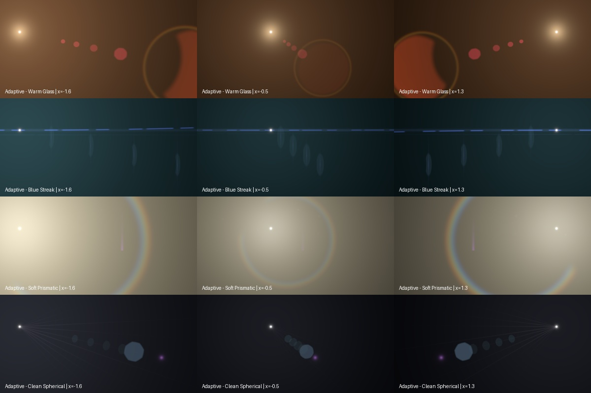

# Flare anatomy and adaptive optics study

## Evidence and scope

This is a visual breakdown of **all 30 featured poster previews on the first
page as displayed during inspection**. The live gallery listed 24 pages;
this report does not claim to inventory every asset in that larger catalog.
The search-indexed category page has a different order and selection, so the
names below follow the actual browser view, not search snippets.

The accessible evidence is compressed, display-encoded preview imagery.
The browser created preview video players, but playback remained paused at
time zero with no loaded duration. Consequently no source trajectories,
frame-by-frame parameter fits, exposure measurements or motion velocities
were extracted. All motion behavior below is an implementation hypothesis,
not a measurement of these commercial clips. Occluded/overlapping components
cannot always be separated uniquely from one image.

No Lens Distortions texture or video has been copied into the FlareCore
library. The new presets are original procedural constructions based on
general observable shapes and are not branded lens reproductions.

## What the reference images reveal

The central modeling error to avoid is treating a flare as a row of equally
important sprites. The references combine several spatial scales and several
coordinate systems. A very broad veil can wash over nearly the whole frame,
while a fine spike occupies only a handful of pixels. An aperture chain may
run diagonally while an anamorphic streak remains horizontal. The large
reflection near an edge does not have to share the small ghosts' intensity,
softness, aspect, or visibility envelope.

### Layer anatomy

| Layer | Visible evidence | Useful representation | Motion hypothesis to expose as controls |
|---|---|---|---|
| Source image | Bright compact or clipped luminous region; sometimes outside the poster | Compact glow plus a separate bloom | Follow source position; never infer its radius from clipped white pixels alone |
| Local bloom | Smooth falloff surrounding the source; much broader than its core | Moffat-style glow | Independent gain and size; avoid scaling all distant ghosts with the bloom |
| Veiling scatter | Large low-frequency field, often warm, cyan, or violet | Broad glow with gentle falloff | Edge-dependent emergence; may strengthen while small ghosts fade |
| Aperture ghosts | Repeated discs, rounded polygons and asymmetric ovals | Separate iris instances; different offsets, size, tint and softness | Independent radial gain, width, height and size curves; split a chain into elements for distinct responses |
| Large reflection | Broad red/orange or pale blue patch, often clipped by the frame | Large iris plus optional separate rim | Size can increase while its visible area decreases; shape clipping should be independent of opacity |
| Barrel-clipped ghost | Crescent or crescent-like partial boundary | Iris/hoop with a crescent mask | Increase clipping with source displacement; tune direction independently from squeeze |
| Thin coating boundary | Colored perimeter, often stronger than the interior | Ring/hoop with modest dispersion | Separate boundary brightness from fill; avoid giving the whole disc saturated RGB fringes |
| Anamorphic streak | Long horizontal illumination, uneven bright lobes and dark interruptions | Narrow streak plus broad soft envelope and companion line | Keep screen orientation fixed; vary width, height, energy and bow independently |
| Vertical pings | Fine short vertical lines at several positions along a horizontal flare | Narrow glints attached to individual ghost positions | Separate gain envelopes and lengths; do not make the entire streak rotate to aim these |
| Directional fan | Broad wedge with multiple faint radiating lines | Many weak glint rays with a limited angular window | Change envelope and spread carefully; avoid a regular starburst when the reference is a fan |
| Prismatic arc/fan | Wide chromatic arc with imperfect brightness and fine structure | Spectral ring plus separate faint irregular detail | Let the arc expand, clip and fade separately from the broad white veil |
| Lens-surface contamination | Fine surface detail may modulate some broad flares, but not reliably resolved in every poster | Very faint fixed orbs/texture | Fix pattern/seed to lens; sum source illumination instead of switching the pattern's driver abruptly |

### Every featured poster, individually

Locations below describe the inspected poster, not a fixed rule for the
lens. Several layers may be unresolved blends of reflections. Relative
brightness is qualitative because these are graded/clipped previews.

| Featured example | Visible component breakdown | Construction implications |
|---|---|---|
| Cineovision Anamorphic 6 | Cool teal background veil; low blue horizontal line with separated bright segments and a central gap; sparse thin vertical blue pings; faint broad ghost field. | Model the envelope and narrow interrupted line separately. Keep the line horizontal and attach pings to their own offsets. |
| Classic Light Hits 1 | Broad near-white upper/left wash fading toward olive warmth; a colored curved/fanned region toward the lower right; tiny components are overwhelmed by the veil. | A large scatter field carries most of the image. Make the prismatic feature a weak independent layer, not a rainbow around every core. |
| Master Prime 1 | Luminous source near the upper-right boundary; many low-contrast diagonal rays spreading into a dark warm-violet field; little obvious discrete ghost structure. | A directional ray fan and soft veil matter more than a polygon chain. Preserve strong variation between the brightest rays and the barely visible ones. |
| Classic Light Hits 3 | Extensive creamy white illumination with warm intermediate tones and diagonal chromatic texture near the lower-right edge. | Use a wide bloom plus an edge-emergent spectral region. Avoid adding sharply outlined ghosts merely because other references contain them. |
| Cineovision Anamorphic 7 | Broad blue horizontal reflection segments, brighter and thicker than 6; several very thin vertical pings; cyan/green veiling light toward the right. | Width and thickness need separate controls. Blurred bright segments should sit over a dim continuous envelope. |
| Cineovision Anamorphic 8 | Fine blue-white horizontal line across much of the image; narrow vertical crossings; faint tall curved/oval boundaries underneath; source-side cyan spill. | The streak, pings, oval ghosts and veil need different gains. Tall ghost shape should not force a vertically stretched source bloom. |
| Leica 1 | Small red/magenta reflections recede diagonally toward the upper right; a much larger red reflection is clipped at the lower-left border; faint enclosing warm boundary. | Use a substantial spread of sizes and offsets. The large edge reflection needs its own clipping and brightness curve. |
| Leica 2 | Bright region toward the upper left; diagonal pink/red ghost chain; small amber intermediate spot; large red reflection approaching the lower-right edge. | Preserve mixed coating colors within one chain. Direction and relative scale come from source geometry, not a global color lookup. |
| Master Prime 13 | Bright source outside/near the upper-right corner; soft warm/violet diagonal fan into a dark field, without a strong isolated ring. | A sibling geometry to the other clean fan reference, with independently tuned veil and ray envelope. |
| Classic Light Hits 4 | Large diffuse bright wash, colored arc boundaries around its outer region, and a prominent tapered violet vertical feature near the lower center. | Separate veil, annular chromatic structure and one-sided violet ray. One global scale cannot reproduce their proportions. |
| Leica 3 | A small pale pink lobe and several red/magenta ghosts on the left-to-center axis; very large orange/red reflection clipped on the right, with a faint curved warm boundary. | Combine soft small ghosts with a different, larger fill/rim pair. The outer reflection must be able to squeeze and clip independently. |
| Classic Light Hits 2 | Broad smooth ivory/warm illumination, filling nearly the whole poster; very little sharp internal structure is resolved. | Restraint means very few layers here. A scatter profile and exposure envelope are more useful than extra geometry. |
| Classic Light Hits 38 | Bright upper region, a wide chromatic ring/arc visible toward the margins, and two narrow violet streak-like features low in the frame. | Keep the broad ring imperfect and the paired vertical features local. Their visibility must be independent of the veil. |
| Kowa Anamorphic 1 | Soft violet horizontal band with a brighter, blurred warm center region; cool veiling light stronger toward the right; much softer segmentation than the Cineovision posters. | Use a thick soft envelope with a weak narrow component. Do not reuse a sharp blue hairline at the same relative strength. |
| Cooke Panchro 1 | Pale blue rounded polygonal ghost with a small brighter center; violet compact companion; faint overlapping blue ghosts and an offset purple oblique feature. | Different aperture sizes and tints; retain softness. A violet companion should be separate from the main polygon and its internal highlight. |
| Leica 4 | Large dark red reflection at lower left; a row of smaller red ghosts diagonally toward upper right; a faint greenish peripheral sliver near the source side. | Opposed large and small reflections plus a weak contrasting edge feature. The green sliver should not recolor the whole flare. |
| Leica 5 | Small pale pink source-side lobe and red ghost train; broad orange reflection clipped along the right edge, surrounded by darker red. | Fill and rim need different colors and soft edges. Treat the large orange region as a separate element with its own aspect response. |
| Classic Light Hits 16 | Creamy diffuse source-side light, olive intermediate field, and fine diagonal prismatic texture toward the opposite lower corner. | Veil-dominant construction with faint corner texture. Avoid strong central concentric rings if they are not resolved. |
| Kowa Anamorphic 2 | Soft purple horizontal band, a warm blurred bright patch near its middle/right, and a spreading cyan-gray field. | Soft anisotropic ghosts and the broad band dominate. Independently animate patch size and streak thickness. |
| Master Anamorphic 1 | Broad blue-violet wash, strong cyan light at upper right, and a faint upright/oblique blue feature; no dominant crisp line in this poster. | Anamorphic does not always mean a bright hairline. Allow the streak opacity to approach zero while the veil survives. |
| Classic Light Hits 40 | Large muted field beneath bright top light, chromatic curved structure along opposing edges, and angled colored texture at lower left. | A large arc partly outside frame plus a broad veil; use independent arc scale and edge visibility. |
| Cineovision Anamorphic 116 | Mostly neutral/warm segmented horizontal line, deep gap near the middle, narrow vertical ping, and bright detached terminal segment toward the right. | Same general vocabulary as the blue versions but different transmission. Do not bake blue into the streak shape. |
| Leica 8 | Warm orange light at left; red overall spill; intermediate polygonal red reflection; large tall red boundary/reflection on the right. | Layer a warm veil under two reflection scales. The tall right-hand feature needs independent horizontal squeeze. |
| Leica 9 | Extensive reddish field with a broad bright curved boundary on the right; softer intermediate red/orange reflection toward the left/center. | Large fill and perimeter should vary independently, so changing the boundary does not uniformly brighten the interior. |
| Classic Light Hits 34 | Bright white upper field; large multicolor peripheral arc; tapered violet ray near lower center and fine striated color at the outer edges. | Similar component vocabulary to 4/38 but distinct proportions. Arc size, veil intensity and violet-ray gain are separate controls. |
| Cooke Panchro 2 | Blue polygonal/disc ghost with bright center toward lower left, violet compact companion, faint dark teal chain, and an oblique violet feature toward upper right. | Preserve separate small and large components across the source-to-center axis. Directional companion should not be merged into the polygon texture. |
| Cineovision Anamorphic 10 | Low blue segmented line; fine vertical blue ping; dark teal veiling field and faint larger reflection boundaries. | Keep the veil dim, and vary local streak segments rather than adding global temporal flicker. |
| Cineovision Anamorphic 2 | Long separated blue horizontal lobes with a dark central break, a thin vertical ping toward the right and diffuse source-side cool haze. | Streak interruption belongs in local element coordinates; otherwise the gaps slide unrealistically as the light moves. |
| Cineovision Anamorphic 102 | Neutral pale horizontal band with softer joining regions; several tall fine vertical pings; broad gray/warm source-side spill. | Build a soft connecting envelope and sharp pings with different widths. Allow neutral coating colors in the same system. |
| Cineovision Anamorphic 112 | Neutral warm separated horizontal lobes and a deep center gap; one stronger vertical crossing on the right and a detached bright terminal patch. | Contrast between the gaps and envelope matters. Independent ping opacity avoids forcing all features to appear simultaneously. |

The source galleries for these families are [Cineovision](https://lensdistortions.com/browse/vfx/cineovision-anamorphic/),
[Classic Light Hits](https://lensdistortions.com/browse/vfx/classic-light-hits/),
[Master Prime](https://lensdistortions.com/browse/vfx/master-prime/),
[Leica](https://lensdistortions.com/browse/vfx/leica/),
[Kowa](https://lensdistortions.com/browse/vfx/kowa-anamorphic/),
[Cooke Panchro](https://lensdistortions.com/browse/vfx/cooke-panchro/) and
[Master Anamorphic](https://lensdistortions.com/browse/vfx/master-anamorphic/).

## Translating anatomy into motion

The implementation now evaluates independent response curves before rendering
each element for each source. It does not accumulate state over frames or
introduce random jitter per frame. If a source returns to the same position
with the same brightness/occlusion, the response is the same. Existing seeded
imperfections retain their identity. This is especially useful for video
chunks, reverse playback, manually edited paths and tracking corrections.

Each curve is a list of strictly increasing input/output knots. Linear or
bounded smoothstep interpolation joins neighboring knots; values outside the
knot range hold the nearest endpoint. Smoothstep has zero slope at each knot
and cannot overshoot into negative sizes or opacity. This favors stable
art-directed transitions, but can create an unwanted pause if too many knots
are used. Use fewer knots or linear interpolation when a constant-rate change
is desired. No automatic fit to the reference video is claimed.

### Driver coordinates

| Driver | Meaning | Practical use |
|---|---|---|
| radius | Distance of source from frame optical center, in half-frame-height units | Ghost breathing and barrel clipping, independent of editable flare anchor |
| x | Source horizontal position divided by frame aspect; -1/+1 are left/right edges | Left/right asymmetry, continuous rotation and streak bow |
| y | Source vertical position; -1/+1 are top/bottom edges | Vertical aspect changes, displaced companion ghosts |
| edge | Distance inside nearest frame edge in half-height units; negative outside | Veil/arc emergence and fade outside the image |
| brightness | Source input brightness before flicker, edge fade and occlusion | Artistic nonlinear exposure response; not calibrated radiometry |
| occlusion | 0 visible, 1 covered | Additional shape/visibility modulation; normal occlusion still applies |

Radius is deliberately independent of the movable flare anchor. Moving the
anchor spaces the chain artistically; it should not change where the physical
frame center is. X normalization keeps horizontal control convenient on wide
frames, while radius and edge distances remain aspect-correct height units.

### Response properties and composition order

- Opacity is a nonnegative **energy multiplier**, applied after legacy trigger
  intensity so an opacity of zero stays off even if a trigger adds brightness.
  This is additive light, not an alpha-over surface opacity.
- Size, width and height multiply their base values. Width/height act in the
  element's local rotated frame; the existing global anamorphic aspect remains
  a separate screen-horizontal transform.
- Rotation adds degrees; axis offset adds a source-to-anchor offset; horizontal
  and vertical shift add half-height screen coordinates before pinning.
- Softness, dispersion and lit-edge shade replace their base settings.
- Barrel clipping, roundness and streak bow replace the applicable shape
  parameter. Unsupported shape/property combinations fail validation.
- Red, green and blue transmission multiply the base element color separately.

Response curves apply to the element before the legacy trigger. Legacy trigger
scale and rotation may add further changes. A count-chain shares its element's
response; create separate elements if individual ghosts need different curves.
One curve per target prevents ambiguous overwrite order. Curves default off
when absent, and the per-element Enable response checkbox bypasses them without
deleting the authored curves. Existing presets remain opt-in.

Global edge fade, depth occlusion, light brightness and optional flicker remain
additional factors. Source motion itself comes from the existing manual,
tracking, camera-follow or path subsystem. These changes do not fix tracking
errors; a jumping source still yields a jumping response.

### Lens-surface illumination

The optional `screen_blend: "all"` sums contributions from all lights for a
screen-space element. The same coordinates and seed are used for each source,
so the lens pattern is not re-randomized. This removes the hard change in driver
when the brightest light switches. Cost grows with light count. Existing
elements retain `"strongest"`; the soft-prismatic example opts into `"all"`.
To keep dirt fixed, animate its energy, not its scale/rotation/position.

## New adaptive looks

All four use the same response system and can be modified freely:

- **Adaptive - Warm Glass:** small red reflection chain, separate large warm
  edge reflection, rim and source veil; independent clipping/size/energy.
- **Adaptive - Blue Streak:** broken horizontal line, soft envelope, lower
  companion, separate vertical pings and tall oval ghosts; varying bow/width.
- **Adaptive - Soft Prismatic:** broad warm-white spill, expanding spectral
  arc, violet companion ray and faint lens-surface specks.
- **Adaptive - Clean Spherical:** directional fan, blue aperture, violet
  companion and faint chain with less veiling light.

The [forward/reverse sweep](motion_previews/adaptive_sweep.gif) is a generated
FlareCore preview, not reference footage. The sampling is deliberately short
for review; GIF palette quantization should not be confused with HDR renderer
precision. `scripts/build_adaptive_collection.py` reproduces these artifacts.

## Limits and next evidence needed

The new system provides the control vocabulary required by these posters, but
its authored curves are not a solved optical prescription. Surface curvature,
coatings, diffraction and aperture-dependent ray transport are not simulated
from lens construction. The current procedural spectral arc also lacks the
full fine prismatic texture in the photographed Classic Light Hits examples.

Full-resolution clips would permit the next step: annotate source positions,
track each visible component, fit centroid/ellipse/intensity envelopes, then
hold out several positions for validation. Use unclipped linear footage or a
known display transfer function and exposure if energy comparisons matter.
Separate appearance differences caused by exposure from changes in optical
geometry. Without that evidence, do not call these presets exact lens matches
or claim that every asset across all 24 gallery pages has been analyzed.
